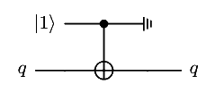

# Proto-Quipper-R
Proto-Quipper-R is a typechecker for Proto-Quipper that can check upper bounds on the width of the quantum circuits produced by a program.

As an example, consider a function `dumbNot` defined as:
```
\q :: Qubit . let a = apply(QInit, ()) in apply(CNot, (a, q))
```
applying `dumbNot` on an input `q` produces the following circuit of width 2:



Running the Proto-Quipper-R typechecker on `dumbNot` returns the following type:
```
Qubit ->[2,0] (Qubit, Qubit)
```
which correctly reflects the idea that `dumbNot` takes as input a qubit and produces a circuit of width 2 (the first annotation on the arrow) which outputs two qubits.
Note that the second annotation on the arrow tells us that this function does not capture any wires from the surrounding environment.

More examples programs can be found in the `examples` folder.


## Installing
Note: Proto-Quipper-R requires [cvc5](https://cvc5.github.io) to be installed and present in your `PATH`.

```
$ git clone https://github.com/andcol/proto-quipper-r
$ cd proto-quipper-r
$ stack install
```

## Running

Usage:
```
$ pqr filepath [-v] [-h] [--version]
```

## Tests
You can run tests with `stack test`